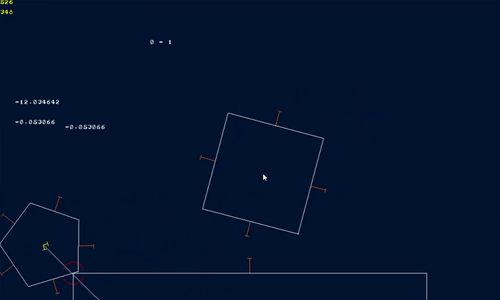

# Showcase
3rd party resources: 
DirectX, 
GDIPlus - for loading images. 
both come with windows 
 
I was making DirectX 2d game engine and stuck on physics part. 
I really wanted to make it work, it was year ago already 
Mostly it's finished, but physics are too jittery and unstable 
 
just in case,  
there is little demo in the release folder, it requires font.png 
(press left and right mouse buttons for draging object)

